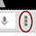

# EZproxy Bookmarklet for Android
*Mobile browsers require several taps and some copy-paste to install a bookmarklet, but if you set it up, the mobile version is easy to use.*

## Part One: Creating the Bookmark
1. Open **Chrome** browser and view this page (the one you're reading now)
2. Tap on the **star icon** next to the URL
3. Tap **Save** to create a bookmark
4. Note where it saves, for example, **In Mobile Bookmarks**

## Part Two: Editing the Bookmarklet
1. Select and copy the entire bookmarklet code.
	<pre>javascript:void((function(){location.href='https://ucsf.idm.oclc.org/login?qurl='+encodeURIComponent(location.href);})());</pre>
2. Tap the **menu options icon**  and select **Bookmarks**. Be sure you're viewing **Mobile Bookmarks** or wherever you saved it
3. Tap and hold to choose the **Reload via EZproxy** bookmark and then **Edit bookmark**
4. Delete text from **address/URL field**
5. **Paste** to add the javascript code instead
6. Tap **Save**

## Using the Bookmarklet
1. NOTE: Bookmarklet is only needed if you go *directly* to a journal -- *not* starting from a link on the UCSF Library website.
2. Clicked to view an article and not granted full access? Start typing "Reload via EZproxy" into the address/URL above article.  Choose the suggestion with "javascript:void" below it to trigger the bookmarklet.
3. You will be prompted to log in with your MyAccess credentials.
4. Once authenticated as UCSF, you should get the full text.
5. You will remain authenticated as UCSF until you close the browser.

## Problems?
-	The Library does not subscribe. Check [holdings.](http://ucsf.worldcat.org/m/)
-	The Library needs to adjust our EZproxy configuration. [Report](http://m.ucsf.edu/#/library/help) the problem.
-	Your MyAccess login is invalid. [Verify](https://myaccess.ucsf.edu/) your account.
-	Need help with EZproxy? Contact [Library Support.](http://m.ucsf.edu/#/library/help)