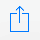
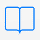

# EZproxy Bookmarklet for iOS
*Mobile browsers require several steps to install a bookmarklet, but if you set it up, the mobile version is easy to use.*

## Part One: Setup
1. Using iPhone? Skip and go to Part Two
2. On iPad, go to **Settings** and tap **Safari**
2. Set **Show Favorites Bar** > ON

*Control what appears in your iPad Favorites Bar: open Safari and tap the bookmarks icon. Then tap Edit.*

## Part Two: Creating the Bookmark
1. Open **Safari** browser and view [this page](http://bookmarklet.library.ucsf.edu/) (the one you're reading now)
2. Tap on the **share icon**  found at top or bottom of your screen
3. Tap **Bookmark**  found at top or bottom of your screen to save this page
4. Ensure save is to **Locations** > **Favorites** and then tap **Done**

## Part Three: Editing the Bookmarklet

1. Select and copy the bookmarklet code. If needed, adjust the selection, to include all before tapping **Copy**
    <pre>javascript:void((function(){location.href='https://ucsf.idm.oclc.org/login?qurl='+encodeURIComponent(location.href);})());</pre>
2. Tap the **bookmarks icon**  and be sure you're viewing **Favorites**
3. Tap **Edit**
4. Select the bookmark saved in Part Two, called **Reload via EZproxy**
5. Tap the **address/URL field** and clear it by tapping the **x**
6. Tap on the word **Address**, and tap **Paste** to add the javascript code
7. Tap **Done** twice: once in the keyboard and once at lower corner of the Favorites box

## Using the Bookmarklet
1. Clicked to view an article and not granted full access? Tap the **bookmarks icon**  > **Favorites** > **Reload via EZproxy**.
2. You will be prompted to log in with your MyAccess credentials.
3. Once authenticated as UCSF, you should get the full text.
4. **NOTE**: Bookmarklet is only needed if you go *directly* to a journal website rather than through the UCSF Library website.

## Problems?
-	The Library does not subscribe. Check [holdings.](http://ucsf.worldcat.org/m/)
-	The Library needs to adjust our EZproxy configuration. [Report](http://m.ucsf.edu/#/library/help) the problem.
-	Your MyAccess login is invalid. [Verify](https://myaccess.ucsf.edu/) your account.
-	Need help with EZproxy? Contact [Library Support.](http://m.ucsf.edu/#/library/help)
